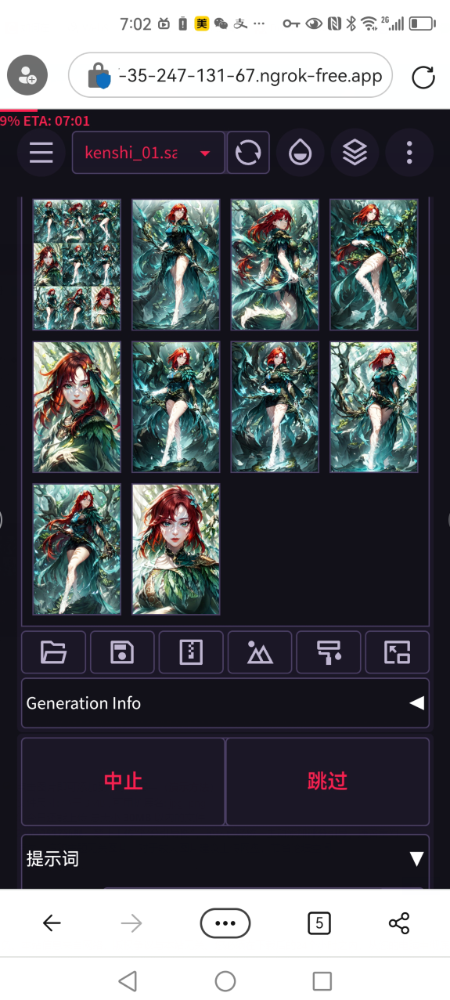
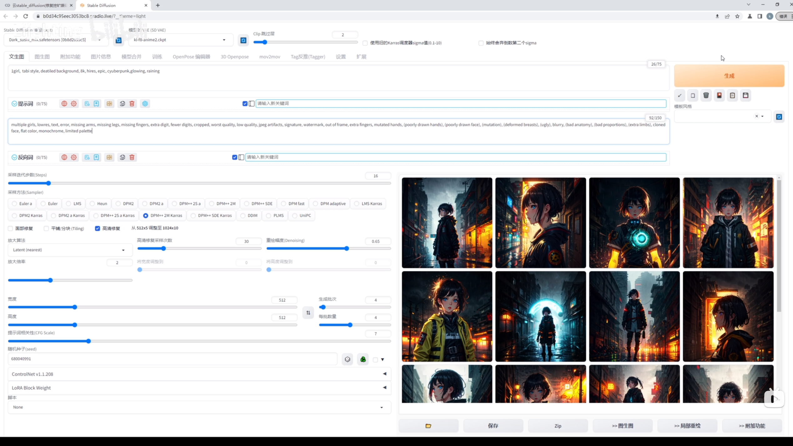

<h1 align="center">colab_stable_diffusion_webui</h1>

  
👇Click on the image to access Colab👇

   

🚀Parallel downloading tree shaking optimization providing faster deployment🚀 
🎇Optional features, allowing users to customize flexibly🎇 
✨If you like it, please give it a ⭐! Your support is the driving force behind my continuous updates✨ 
 
[简体中文](README.md) | English

[Feature List](#Feature) | [Video Demonstration](https://www.bilibili.com/video/BV17h4y1J79g/?spm_id_from=333.788.top_right_bar_window_history.content.click) | [FAQs](#FAQ) | [Changelog](#Update) | [Preview Image](#Preview) 

## 💡 Feature List
- [x] Mod Management System: Manage mods and use thread pool downloading to achieve speed faster than copying to cloud storage without occupying disk space.
- [x] Local Image Information Reading Script: Use a JavaScript script to process SD images locally to save time and bandwidth from server interactions while ensuring reliability.
- [x] Automatic Image Saving Script: Use a JavaScript script to automatically save generated images, avoiding the hassle of manually saving each image.
- [x] Mobile Adaptation: Use media queries and change the global style to avoid misoperation or make it compatible with [anapnoe](https://github.com/anapnoe/stable-diffusion-webui-ux) version.
- [x] Initialization of Best Configuration: Initialize the configuration based on the best user experience to solve the hassle of manual configuration when users enter the page.
- [x] Use of ngrok tunnel from [Automatic111](https://github.com/AUTOMATIC1111/stable-diffusion-webui) to effectively improve network speed.
- [x] Support for custom VAE and plugins, please create folders named "VAE" and "extensions" in your cloud storage and manage them on your own.

<h2>🔍 FAQs</h2>
<h3>About colab</h3> 

- Advantage: No need for a graphics card, can be used on mobile phones, and has fast cloud-based processing speed. Disadvantage: Needs to be redeployed every day and has time limitations.
- This project is a free and open-source project and will continue to be maintained and updated. Please report any advertising motives.
- Colab has always been free and conscience. If you feel that the image generation speed is slow or the duration is short, or it's too troublesome, you can also support Google.
- Due to the large number of users, the time limit for each Google Colab account is about 4-6 hours. You can create multiple accounts and add editing permissions to other accounts in the main account's JSON folder to achieve shared usage among all accounts.
- The first startup within a day takes about 7 minutes to download plugin model dependencies. Please be patient. It will be much faster for subsequent startups.
- You can also run Colab notebooks on your computer and access them through the domain provided in Step 4 using your phone.
- The Google environment has 12GB memory and 15GB video memory. As there is more video memory than actual memory, it's recommended to use half-precision for calculations.
- In the mod management unit, only fill in the download address for Lora and Checkpoint. You can also add some information for easy management.
- Notebooks are single-threaded, so please make sure that the mod management cell is not running before managing mods.
- When managing mods, it's recommended to name them in the format of "c-site mod name (custom name)" for easy searching of SD images on c-site and for easy searching in the Lora list when in use.
- Newcomers who don't know which models to download can go to the "Recommended Model Documentation" cell to download the JSON file.
- To load custom VAE and plugins, or models in the cloud drive, please create a new folder "VAE", "extensions", "lora", or "checkpoint" in the cloud drive and manage it yourself
- If the code is not executable, do not perform any operations and wait for a fix. We are not responsible for any time limitations.
- There are many users during peak hours, and connection errors or disconnections are normal. You can try to use the ngrok tunnel to speed up the process.
 
<h3>About stable-diffusion</h3> 

 - If the image information reads "不是一张stable diffusion图片", it means that the image uploaded by the author has undergone compression. You can copy the text and seed manually or use the "tagger图生文" tool for translation.
 - Sampling method recommend DDIM and DPM++ 2M ,Hires. fix recommend Latent (nearest) and ultimate-upscale
 - You can choose to output the images to the "outputs" folder in your cloud storage or download them automatically.
 - The image generation speed and code execution speed are not affected by internet speed. Even if you are disconnected for a few minutes, it will still continue executing.
 - If you encounter the error message "there's not enough precision to represent the picture", you can switch to another VAE or select full precision during the fourth step of execution. However, the image generation speed will be reduced by half.
 - Type "<" to access "lora".
 

<h2>📔 Changelog</h2>

### v2.2.0(23/08/26)
- Partially refactored the download management module to support downloading with specified path fields.
- Upgraded webui to the latest version 1.5.1 and changed 1.3.0 to stable version.
### v2.1.2(23/08/07)
- Optional to load the config.json file from cloud storage
### v2.1.1(23/07/22)
- Using the libtcmalloc included in Colab to fix the compatibility issue with Ubuntu 22.04 that causes memory leaks.
### v2.1.0(23/06/17)
- Also supports reading checkpoint and lora from cloud drive. Please create a new folder "checkpoint" or "lora" in the cloud drive.
- The model documentation can be placed in any folder in the file directory, and will be recursively searched and read.
### v2.0.9(23/06/03)
- Default version change to[Automatic111v1.3.1](https://github.com/AUTOMATIC1111/stable-diffusion-webui/releases/tag/v1.3.1)
- Script compatibility updates have been made for[anapnoe](https://github.com/anapnoe/stable-diffusion-webui-ux)updates.
### v2.0.8(23/06/01)
- The mod downloading unit uses a thread pool for parallel downloading.
### v2.0.7(23/05/28)
- Added a script to automatically save generated images to your local device.
- If the image information module reads "not an SD image", it will recommend switching to the "tagger" module.
### v2.0.6(23/05/25)
- Due to the update of [xformers](https://github.com/facebookresearch/xformers) to version 0.0.20, torch downloading has been cancelled, significantly reducing download time.
- Added Chinese translation prompts using [all-in-one](https://github.com/Physton/sd-webui-prompt-all-in-one).
### v2.0.5 (05/23/19):
- The torch issue has been fixed.
### v2.0.5 (05/14/23):
- Optimized mod downloading with LCS algorithm for minimizing updates.
- Added an option to choose dark theme for SD original UI.
### v2.0.4 (05/12/23):
- Added openpose3d plugin.
- Added a recommended mod documentation download unit.
- Added custom plugins and VAE methods.
### v2.0.4 (05/09/23):
- Added an option to run without mounting cloud storage.
### v2.0.3 (05/03/23):
- Fixed scripts according to the major version update.
- Default UI changed back to [Automatic111](https://github.com/AUTOMATIC1111/stable-diffusion-webui), anapnoe is optional.
### v2.0.2 (04/29/23):
- Memory leak issues have been resolved.
- Optimized the interaction of the mod management unit, supporting document switching.
### v2.0.1 (04/27/23):
- Switched to a better and more adaptable UI system from [anapnoe](https://github.com/anapnoe/stable-diffusion-webui-ux).
- Solved the problem of insufficient memory when switching mods with instructions to some extent.
- Solved the problem of certain specific sizes of images unable to be generated.
- Configured ngrok acceleration.
### v2.0.0 (04/27/23):
- Added a mod add, delete and search system.
- Refactored the mod downloading module, no need to save mods on cloud storage anymore.
### v1.1.4 (04/24/23):
- Updated ControlNet 1.1.
- Added custom settings.
### v1.1.3 (04/21/23):
- Fixed the issue of suspicious mining dialog box.
- Some cells use asynchronous downloading to enhance execution efficiency.
- Switched to [Dark Sushi Mix](https://civitai.com/api/download/models/33482) as the default large model.
- The default number of ControlNet control models is changed to 3.
### v1.1.2 (04/17/23):
- Fixed the issue of too large width for locally drawn images on mobile phones.
### v1.1.1 (04/12/23):
- Updated [CN_tag_trans](https://www.bilibili.com/video/BV1tg4y137mt/?spm_id_from=333.880.my_history.page.click&vd_source=931a87555c05909a4816745522b3ce74).
- Added a function to quickly fill in information from PNG images.

<h2 id="Preview">Preview Image</h2>

